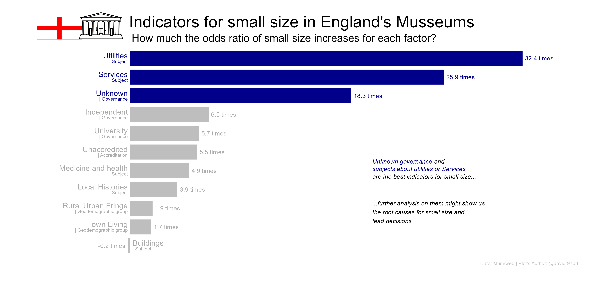

## 1. Question

Which factors are associated to a small size (low visits) in museums of England that never closed or closed after 2018?


```{r logistic_functions, echo=FALSE, message=FALSE, warning=FALSE}
source('0_Veifying_logistic_regression_assumptions_functions.R')
```

## 2. Getting the data
The data was comes from , which can be found in the library `tidytuesdayR`. I'm only interested in analyzing **England's museums that never closed or closed after 2018**, so I will take only take museums that meet that criteria.

Due to the disparity in the levels of `Size`, I decided to have two labels: one for **'small'** size and other for **the others levels**.

```{r Getting_data, message=FALSE, warning=FALSE, cache=TRUE}
library(tidytuesdayR)
# Get data ####
raw_data <- tidytuesdayR::tt_load('2022-11-22')[[1]]

# Clean data to explore ####
exploratory_data <- raw_data %>%
     ## Separating columns
     separate(Year_closed, 
              into = c('low_closing', 
                       'high_closing')) %>%
     separate(Year_opened, 
              into = c('low_opening', 
                       'high_opening')) %>%  
     separate(Admin_area, 
              into  = c('Nothing', 
                        'Country'), 
              sep   = '/', 
              extra = 'drop') %>%
     separate(Subject_Matter, 
              into  = c('Subject'), 
              sep   = '-', 
              extra = 'drop') %>%
     separate(Governance, 
              into  = c('Governance'), 
              sep   = '-', 
              extra = 'drop') %>%
     ## Filtering to have the population of interest
     filter(high_closing > 2018, 
            Size != 'unknown', 
            Country == 'England') %>%
     mutate(Size = ifelse(Size == 'small', 
                          1, 
                          0))
```

## 3. Exploring the data
For the first model, I chose only the factors' levels that might which proportions of `Small size` and `Other sizes` were significantly different to the population's proportions, and the other levels of that factors were labelled as others. In continuous variables, I chose the variables that might show a different behaviour for each level of the factor `Size` (the criteria was a visual inspection).

## 3. Building the model
Before observing any coefficient or p-value, it's important to verify the logistic regression assumptions, that's why I didn't pay attention to any p-value (even if they were significant) if the the assumptions weren't met.

### 3.1 First model

```{r model1, echo=FALSE, message=FALSE, warning=FALSE, cache=TRUE}
source('3_Model_1.R'
       )
```

We can see that `Income Index` and `Employment Index` doesn't meet the **linearity assumption**, then we'll remove them.

### 3.2 Second model
```{r model2, echo=FALSE, message=FALSE, warning=FALSE, cache=TRUE}
source('4_Model_2.R'
       )
```
Every assumption is met in this second model, to improve the analysis, we'll remove the non-significant coefficients.

### 3.3 Third model

```{r model3, echo=FALSE, message=FALSE, warning=FALSE, cache=TRUE}
source('4_Model_3.R'
       )
```

In this third model, all assumptions are also met and there is not significant difference to the `model2`, we'll keep `model3` following the parsimonious principle.  Given there were **not numeric variables**, there were not need of verifying the `linear assumption`

## 4. Analysis

As we can see, most factors increases the chances of small `size` in museums, except for subjects about `buildings` (which only decreases the chances by a really tiny proportion). However, `Unknown governance` and subjects about `Utilities` or `Services` are the factors that show the greatest association with the small size, this factors might show us why some museums have low visits (maybe those factors are the cause or they are only associated) and lead new decisions to increase visits in England's museums.

The next step that I would recommend is research further on these three factors to make accurate decisions. 

## 5. Limitations
The data related to Museum `Size` were from the last years before the museum's closing, there's not certainty about whether the museum had that size in the years analysed; however, the museums taken never closed or closed  around 2019-2022, it's likely the size was the same in the period analyzed.

On the other hand, I aggregate the sizes different to 'small' into a single category, so, conclusions only can be applied in terms of **small size** and **NOT small size**. 

## 6. Conclusions
`Unknown governance` and subjects about `Utilities` or `Services` are the factors that show the greatest association with the small size, I further research on these factors might show us the root causes of small size and lead new decisions to increase visits in England's museums.