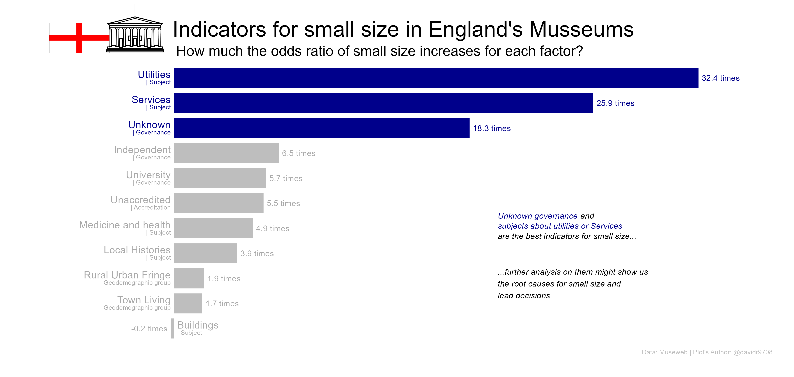

Musseum’s indicators for small size
================

## 1. Question

Which factors are associated to a small size (low visits) in museums of
England that never closed or closed after 2018?

## 2. Getting the data

The data was comes from , which can be found in the library
`tidytuesdayR`. I’m only interested in analyzing **England’s museums
that never closed or closed after 2018**, so I will take only take
museums that meet that criteria.

Due to the disparity in the levels of `Size`, I decided to have two
labels: one for **‘small’** size and other for **the others levels**.

``` r
library(tidytuesdayR)
# Get data ####
raw_data <- tidytuesdayR::tt_load('2022-11-22')[[1]]
```

    ## 
    ##  Downloading file 1 of 1: `museums.csv`

``` r
# Clean data to explore ####
exploratory_data <- raw_data %>%
     ## Separating columns
     separate(Year_closed, 
              into = c('low_closing', 
                       'high_closing')) %>%
     separate(Year_opened, 
              into = c('low_opening', 
                       'high_opening')) %>%  
     separate(Admin_area, 
              into  = c('Nothing', 
                        'Country'), 
              sep   = '/', 
              extra = 'drop') %>%
     separate(Subject_Matter, 
              into  = c('Subject'), 
              sep   = '-', 
              extra = 'drop') %>%
     separate(Governance, 
              into  = c('Governance'), 
              sep   = '-', 
              extra = 'drop') %>%
     ## Filtering to have the population of interest
     filter(high_closing > 2018, 
            Size != 'unknown', 
            Country == 'England') %>%
     mutate(Size = ifelse(Size == 'small', 
                          1, 
                          0))
```

## 3. Exploring the data

For the first model, I chose only the factors’ levels that might which
proportions of `Small size` and `Other sizes` were significantly
different to the population’s proportions, and the other levels of that
factors were labelled as others. In continuous variables, I chose the
variables that might show a different behaviour for each level of the
factor `Size` (the criteria was a visual inspection).

## 3. Building the model

Before observing any coefficient or p-value, it’s important to verify
the logistic regression assumptions, that’s why I didn’t pay attention
to any p-value (even if they were significant) if the the assumptions
weren’t met.

### 3.1 First model

    ## 
    ## Call:
    ## glm(formula = Size ~ ., family = "binomial", data = data_model1)
    ## 
    ## Deviance Residuals: 
    ##     Min       1Q   Median       3Q      Max  
    ## -2.4160  -0.8377   0.3488   0.7918   2.5599  
    ## 
    ## Coefficients:
    ##                                             Estimate Std. Error z value
    ## (Intercept)                                 -2.55912    0.22159 -11.549
    ## AccreditationUnaccredited                    1.68568    0.10607  15.891
    ## GovernanceIndependent                        1.79401    0.14639  12.255
    ## GovernanceUniversity                         1.98061    0.31795   6.229
    ## GovernanceUnknown                            2.73581    0.76086   3.596
    ## SubjectArts                                 -0.13521    0.20290  -0.666
    ## SubjectBuildings                            -0.58952    0.13866  -4.252
    ## SubjectLeisure_and_sport                    -0.05461    0.32688  -0.167
    ## SubjectLocal_Histories                       1.20198    0.14741   8.154
    ## SubjectMedicine_and_health                   1.85180    0.58146   3.185
    ## SubjectMixed                                -0.40960    0.27781  -1.474
    ## SubjectRural_Industry                        0.39679    0.28912   1.372
    ## SubjectServices                              3.25201    1.13273   2.871
    ## SubjectUtilities                             3.47411    1.05436   3.295
    ## Area_Geodemographic_groupRural-Urban Fringe  0.67153    0.29740   2.258
    ## Area_Geodemographic_groupSuburban Traits     0.56596    0.27149   2.085
    ## Area_Geodemographic_groupTown Living         0.52337    0.26281   1.991
    ## Area_Deprivation_index_employment           -0.04427    0.05446  -0.813
    ## Area_Deprivation_index_health                0.05368    0.03413   1.572
    ## Area_Deprivation_index_housing              -0.00523    0.02068  -0.253
    ## Area_Deprivation_index_income                0.02678    0.05812   0.461
    ## Area_Deprivation_index_crime                 0.03692    0.02213   1.668
    ## Area_Deprivation_index_education            -0.06912    0.02952  -2.341
    ## Area_Deprivation_index_services              0.06735    0.01954   3.446
    ##                                             Pr(>|z|)    
    ## (Intercept)                                  < 2e-16 ***
    ## AccreditationUnaccredited                    < 2e-16 ***
    ## GovernanceIndependent                        < 2e-16 ***
    ## GovernanceUniversity                        4.69e-10 ***
    ## GovernanceUnknown                           0.000324 ***
    ## SubjectArts                                 0.505176    
    ## SubjectBuildings                            2.12e-05 ***
    ## SubjectLeisure_and_sport                    0.867311    
    ## SubjectLocal_Histories                      3.53e-16 ***
    ## SubjectMedicine_and_health                  0.001449 ** 
    ## SubjectMixed                                0.140379    
    ## SubjectRural_Industry                       0.169932    
    ## SubjectServices                             0.004092 ** 
    ## SubjectUtilities                            0.000984 ***
    ## Area_Geodemographic_groupRural-Urban Fringe 0.023943 *  
    ## Area_Geodemographic_groupSuburban Traits    0.037103 *  
    ## Area_Geodemographic_groupTown Living        0.046432 *  
    ## Area_Deprivation_index_employment           0.416238    
    ## Area_Deprivation_index_health               0.115844    
    ## Area_Deprivation_index_housing              0.800376    
    ## Area_Deprivation_index_income               0.645023    
    ## Area_Deprivation_index_crime                0.095284 .  
    ## Area_Deprivation_index_education            0.019217 *  
    ## Area_Deprivation_index_services             0.000568 ***
    ## ---
    ## Signif. codes:  0 '***' 0.001 '**' 0.01 '*' 0.05 '.' 0.1 ' ' 1
    ## 
    ## (Dispersion parameter for binomial family taken to be 1)
    ## 
    ##     Null deviance: 3350.4  on 2431  degrees of freedom
    ## Residual deviance: 2477.2  on 2408  degrees of freedom
    ## AIC: 2525.2
    ## 
    ## Number of Fisher Scoring iterations: 6

<!-- -->

    ##                                       GVIF Df GVIF^(1/(2*Df))
    ## Accreditation                     1.146611  1        1.070799
    ## Governance                        1.458153  3        1.064880
    ## Subject                           1.654547  9        1.028369
    ## Area_Geodemographic_group         1.152756  3        1.023976
    ## Area_Deprivation_index_employment 9.341835  1        3.056442
    ## Area_Deprivation_index_health     3.881972  1        1.970272
    ## Area_Deprivation_index_housing    1.279510  1        1.131154
    ## Area_Deprivation_index_income     9.412021  1        3.067902
    ## Area_Deprivation_index_crime      1.805869  1        1.343826
    ## Area_Deprivation_index_education  2.490880  1        1.578252
    ## Area_Deprivation_index_services   1.299607  1        1.140003

<!-- -->

    ## [1] "There are 0 influential values."
    ## # A tibble: 0 × 19
    ## # … with 19 variables: Size <dbl>, Accreditation <chr>, Governance <fct>,
    ## #   Subject <fct>, Area_Geodemographic_group <fct>,
    ## #   Area_Deprivation_index_employment <dbl>,
    ## #   Area_Deprivation_index_health <dbl>, Area_Deprivation_index_housing <dbl>,
    ## #   Area_Deprivation_index_income <dbl>, Area_Deprivation_index_crime <dbl>,
    ## #   Area_Deprivation_index_education <dbl>,
    ## #   Area_Deprivation_index_services <dbl>, .fitted <dbl>, .resid <dbl>, …

We can see that `Income Index` and `dddd` doesn’t meet the **linearity
assumption**, then we’ll remove them.

### 3.2 Second model

    ## 
    ## Call:
    ## glm(formula = Size ~ ., family = "binomial", data = data_model2)
    ## 
    ## Deviance Residuals: 
    ##     Min       1Q   Median       3Q      Max  
    ## -2.4589  -0.8345   0.3718   0.7857   2.4867  
    ## 
    ## Coefficients:
    ##                                             Estimate Std. Error z value
    ## (Intercept)                                 -2.40785    0.18415 -13.076
    ## AccreditationUnaccredited                    1.67098    0.10502  15.911
    ## GovernanceIndependent                        1.81878    0.14576  12.478
    ## GovernanceUniversity                         1.81954    0.31255   5.822
    ## GovernanceUnknown                            2.79646    0.76098   3.675
    ## SubjectArts                                 -0.17034    0.20191  -0.844
    ## SubjectBuildings                            -0.64700    0.13774  -4.697
    ## SubjectLeisure_and_sport                    -0.05874    0.32362  -0.182
    ## SubjectLocal_Histories                       1.31569    0.14423   9.122
    ## SubjectMedicine_and_health                   1.62058    0.57624   2.812
    ## SubjectMixed                                -0.36538    0.27601  -1.324
    ## SubjectRural_Industry                        0.42546    0.28664   1.484
    ## SubjectServices                              3.18179    1.10038   2.892
    ## SubjectUtilities                             3.46729    1.05261   3.294
    ## Area_Geodemographic_groupRural-Urban Fringe  0.66417    0.29816   2.228
    ## Area_Geodemographic_groupSuburban Traits     0.52285    0.27173   1.924
    ## Area_Geodemographic_groupTown Living         0.55675    0.26113   2.132
    ## Area_Deprivation_index_health               -0.01621    0.02218  -0.731
    ## Area_Deprivation_index_housing               0.01923    0.01968   0.977
    ## Area_Deprivation_index_crime                 0.02751    0.02157   1.276
    ##                                             Pr(>|z|)    
    ## (Intercept)                                  < 2e-16 ***
    ## AccreditationUnaccredited                    < 2e-16 ***
    ## GovernanceIndependent                        < 2e-16 ***
    ## GovernanceUniversity                        5.83e-09 ***
    ## GovernanceUnknown                           0.000238 ***
    ## SubjectArts                                 0.398893    
    ## SubjectBuildings                            2.64e-06 ***
    ## SubjectLeisure_and_sport                    0.855964    
    ## SubjectLocal_Histories                       < 2e-16 ***
    ## SubjectMedicine_and_health                  0.004919 ** 
    ## SubjectMixed                                0.185569    
    ## SubjectRural_Industry                       0.137730    
    ## SubjectServices                             0.003834 ** 
    ## SubjectUtilities                            0.000988 ***
    ## Area_Geodemographic_groupRural-Urban Fringe 0.025909 *  
    ## Area_Geodemographic_groupSuburban Traits    0.054334 .  
    ## Area_Geodemographic_groupTown Living        0.032999 *  
    ## Area_Deprivation_index_health               0.464971    
    ## Area_Deprivation_index_housing              0.328641    
    ## Area_Deprivation_index_crime                0.202110    
    ## ---
    ## Signif. codes:  0 '***' 0.001 '**' 0.01 '*' 0.05 '.' 0.1 ' ' 1
    ## 
    ## (Dispersion parameter for binomial family taken to be 1)
    ## 
    ##     Null deviance: 3350.4  on 2431  degrees of freedom
    ## Residual deviance: 2498.0  on 2412  degrees of freedom
    ## AIC: 2538
    ## 
    ## Number of Fisher Scoring iterations: 6

<!-- -->

    ##                                    GVIF Df GVIF^(1/(2*Df))
    ## Accreditation                  1.134630  1        1.065190
    ## Governance                     1.410284  3        1.058972
    ## Subject                        1.526895  9        1.023792
    ## Area_Geodemographic_group      1.145077  3        1.022835
    ## Area_Deprivation_index_health  1.647553  1        1.283570
    ## Area_Deprivation_index_housing 1.165274  1        1.079479
    ## Area_Deprivation_index_crime   1.728815  1        1.314844

<!-- -->

    ## [1] "There are 0 influential values."
    ## # A tibble: 0 × 15
    ## # … with 15 variables: Size <dbl>, Accreditation <chr>, Governance <fct>,
    ## #   Subject <fct>, Area_Geodemographic_group <fct>,
    ## #   Area_Deprivation_index_health <dbl>, Area_Deprivation_index_housing <dbl>,
    ## #   Area_Deprivation_index_crime <dbl>, .fitted <dbl>, .resid <dbl>,
    ## #   .std.resid <dbl>, .hat <dbl>, .sigma <dbl>, .cooksd <dbl>, index <int>

Every assumption is met in this second model, to improve the analysis,
we’ll remove the non-significant coefficients.

### 3.3 Third model

    ## 
    ## Call:
    ## glm(formula = Size ~ ., family = "binomial", data = data_model3)
    ## 
    ## Deviance Residuals: 
    ##     Min       1Q   Median       3Q      Max  
    ## -2.4714  -0.9234   0.3786   0.7137   2.4566  
    ## 
    ## Coefficients:
    ##                                             Estimate Std. Error z value
    ## (Intercept)                                  -2.3426     0.1411 -16.605
    ## AccreditationUnaccredited                     1.7108     0.1040  16.454
    ## GovernanceIndependent                         1.8697     0.1358  13.767
    ## GovernanceUniversity                          1.7386     0.2999   5.798
    ## GovernanceUnknown                             2.9050     0.7572   3.836
    ## SubjectBuildings                             -0.6246     0.1294  -4.825
    ## SubjectLocal_Histories                        1.3617     0.1366   9.970
    ## SubjectMedicine_and_health                    1.5835     0.5738   2.760
    ## SubjectServices                               3.2546     1.1072   2.939
    ## SubjectUtilities                              3.4785     1.0515   3.308
    ## Area_Geodemographic_groupRural-Urban Fringe   0.6165     0.2881   2.140
    ## Area_Geodemographic_groupTown Living          0.5555     0.2595   2.141
    ##                                             Pr(>|z|)    
    ## (Intercept)                                  < 2e-16 ***
    ## AccreditationUnaccredited                    < 2e-16 ***
    ## GovernanceIndependent                        < 2e-16 ***
    ## GovernanceUniversity                         6.7e-09 ***
    ## GovernanceUnknown                           0.000125 ***
    ## SubjectBuildings                             1.4e-06 ***
    ## SubjectLocal_Histories                       < 2e-16 ***
    ## SubjectMedicine_and_health                  0.005788 ** 
    ## SubjectServices                             0.003288 ** 
    ## SubjectUtilities                            0.000940 ***
    ## Area_Geodemographic_groupRural-Urban Fringe 0.032358 *  
    ## Area_Geodemographic_groupTown Living        0.032301 *  
    ## ---
    ## Signif. codes:  0 '***' 0.001 '**' 0.01 '*' 0.05 '.' 0.1 ' ' 1
    ## 
    ## (Dispersion parameter for binomial family taken to be 1)
    ## 
    ##     Null deviance: 3350.4  on 2431  degrees of freedom
    ## Residual deviance: 2511.5  on 2420  degrees of freedom
    ## AIC: 2535.5
    ## 
    ## Number of Fisher Scoring iterations: 6
    ## 
    ##                               GVIF Df GVIF^(1/(2*Df))
    ## Accreditation             1.117741  1        1.057233
    ## Governance                1.155518  3        1.024384
    ## Subject                   1.206227  5        1.018927
    ## Area_Geodemographic_group 1.011001  2        1.002739

<!-- -->

    ## [1] "There are 0 influential values."
    ## # A tibble: 0 × 12
    ## # … with 12 variables: Size <dbl>, Accreditation <chr>, Governance <fct>,
    ## #   Subject <fct>, Area_Geodemographic_group <fct>, .fitted <dbl>,
    ## #   .resid <dbl>, .std.resid <dbl>, .hat <dbl>, .sigma <dbl>, .cooksd <dbl>,
    ## #   index <int>

In this third model, all assumptions are also met and there is not
significant difference to the `model2`, we’ll keep `model3` following
the parsimonious principle. Given there were **not numeric variables**,
there were not need of verifying the `linear assumption`

## 4. Analysis

 As we can see, most factors increases the
chances of small `size` in museums, except for subjects about
`buildings` (which only decreases the chances by a really tiny
proportion). However, `Unknown governance` and subjects about
`Utilities` or `Services` are the factors that show the greatest
association with the small size, this factors might show us why some
museums have low visits (maybe those factors are the cause or they are
only associated) and lead new decisions to increase visits in England’s
museums.

The next step that I would recommend is research further on these three
factors to make accurate decisions.

## 5. Limitations

The data related to Museum `Size` were from the last years before the
museum’s closing, there’s not certainty about whether the museum had
that size in the years analysed; however, the museums taken never closed
or closed around 2019-2022, it’s likely the size was the same in the
period analyzed.

On the other hand, I aggregate the sizes different to ‘small’ into a
single category, so, conclusions only can be applied in terms of **small
size** and **NOT small size**.

## 6. Conclusions

`Unknown governance` and subjects about `Utilities` or `Services` are
the factors that show the greatest association with the small size, I
further research on these factors might show us the root causes of small
size and lead new decisions to increase visits in England’s museums.
